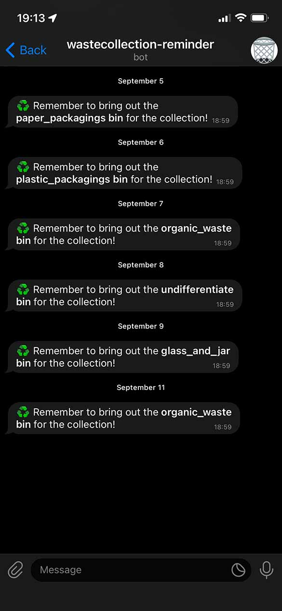

# 🗑 Udine waste collection

This repository contains the code to run a bash script that sends you a Telegram message remembering to expose the correct waste bin for the following day city waste collection.

<figure style="display:block;margin:auto;width:200px;text-align:center;">
  
  <figcaption style="font-size:.8em;">Telegram notifications</figcaption>
</figure>

## Collection days

Following the [Udine collection calendar](https://netaziendapulita.it/comuni/udine) for the 2022, the city collections happens in this days:

|             | Monday | Tuesday | Wednesday | Thursday | Friday | Saturday | Sunday |
| ----------- |:------:|:-------:|:---------:|:--------:|:------:|:--------:| ------ |
| **Circ. 1** | 🟤     | ⚫️⚪️    | 🟡 🔵     | 🟤       | 🟢     | ⚫️⚪️     |        |
| **Circ. 2** | 🟤⚪️   | 🔵      | 🟡        | ⚫️⚪️     | 🟤     | 🟢*      |        |
| **Circ. 3** | 🟤⚪️   | 🔵      | 🟡        | 🟤       | ⚫️⚪️   | 🟢*      |        |
| **Circ. 4** | 🟤⚪️   | 🔵      | 🟡        | ⚫️⚪️     | 🟤     | 🟢*      |        |
| **Circ. 5** | 🟤⚪️   | 🔵      | 🟡        | ⚫️⚪️     | 🟤     | 🟢*      |        |
| **Circ. 6** | 🟤⚪️   | 🔵      | 🟡        | ⚫️⚪️     | 🟤     | 🟢*      |        |
| **Circ. 7** | 🟤⚪️   | 🔵      | 🟡        | 🟤       | ⚫️⚪️   | 🟢*      |        |

where
* 🔵 represents the **paper packagings** collection;
* 🟡 represents the **plastic packagings** collection;
* 🟤 represents the **organic waste** collection;
* ⚫️ represents the **undifferentiate** collection;
* ⚪️ represents the **diapers** collection;
* 🟢 represents the **glass and jar** collection.

## Requirements

In order to successfully run the code, you only need `curl` installed on your system.

## Usage

#### 1. Clone this repository on your PC

First of all, [clone](https://docs.github.com/en/repositories/creating-and-managing-repositories/cloning-a-repository) in you home folder (or wherever you like in your system) the project folder from the GitHub repository.

```bash
cd ~    # Navigate to the place where you want the project folder to be
git clone enstit/wastecollection_reminder
```

#### 2. Create a Telegram bot

> **Note**
> If you don't know how to create a Telegram bot using [BotFather](https://t.me/botfather), read the [official guide](https://core.telegram.org/bots#6-botfather).

After creating the Telegram bot, save your `BOT_TOKEN` and `GROUP_ID`.


#### 3. Edit the configuration file

After [cloning this repository](https://docs.github.com/en/repositories/creating-and-managing-repositories/cloning-a-repository), and once insite its directory, make your copy of the `config` file

```bash
cp config.ini.example config.ini
```

and edit it with your chosen values for the variables.

```bash
nano config.ini
```

##### Environment variables

###### `Collection days` section
* `Monday`: the waste bin that is being collected each Monday;
* `Tuesday`: the waste bin that is being collected each Tuesday;
* ...
* `Saturday`: the waste bin that is being collected each Saturday.

If multiple bins are being collected in a single day, place them into an array.

###### `Notify config` section
* `BOT_TOKEN`: yout Telegram API token to send the notifications with the bot you created previously;
* `GROUP_ID`: the Telgram bot chat ID.
  

#### 4. Add the script to crontab

Enter the crontab configuration file

```bash
crontab -l > mycron # write out current crontab
echo "<MINUTE> <HOUR> * * * /bin/sh <PATH TO THE PROJECT FOLDER>/send_wastecollection_notify.sh" >> mycron # echo new cron into cron file
crontab mycron # install new cron file
rm mycron # remove temporary file
```

changin `MINUTE` to the minute of the `HOUR`, and `HOUR` to the 24-format hour you want to receive the notification. So for example, if you want to be notified each day at 7pm the day before the city collection, simply run

```bash
crontab -l > mycron
echo "00 19 * * * /bin/sh <PATH TO THE PROJECT FOLDER>/send_wastecollection_notify.sh" >> mycron
crontab mycron && rm mycron
```

And you're done!
